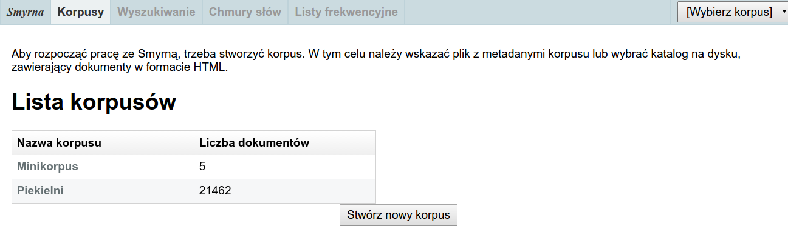
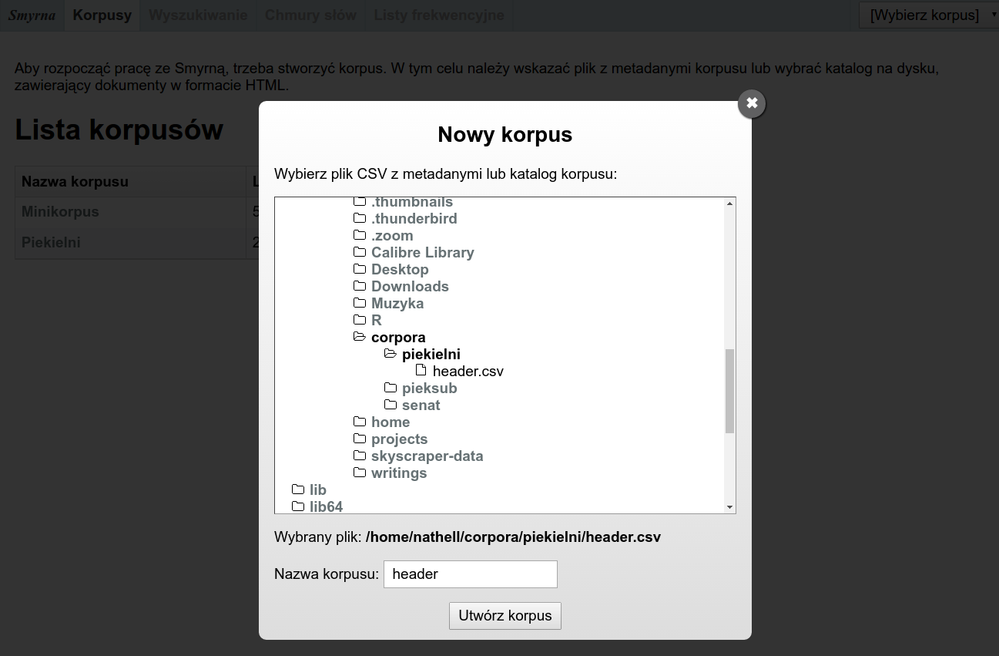
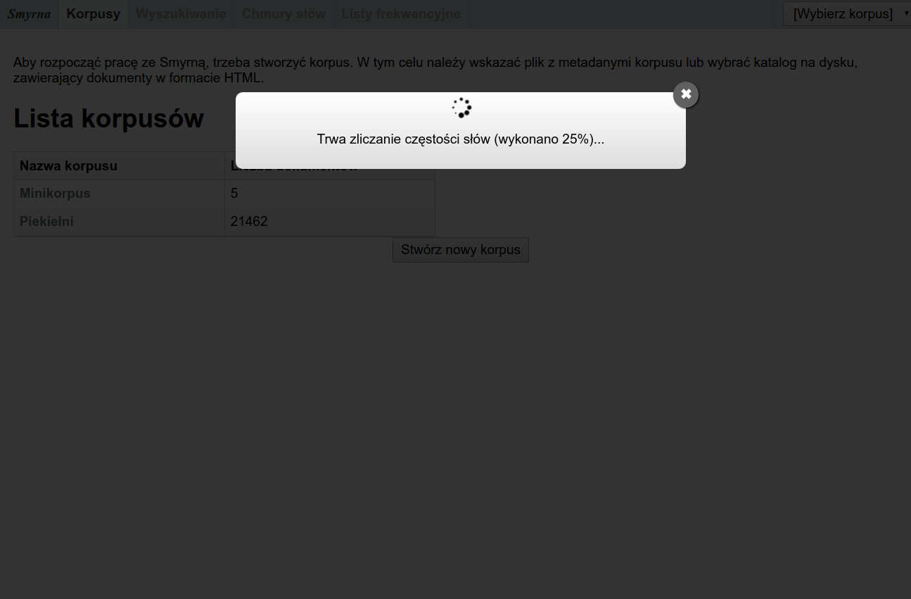
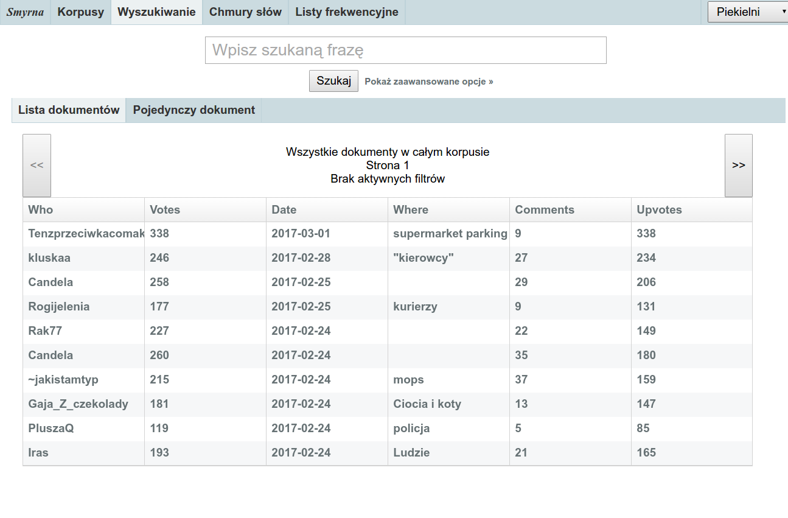
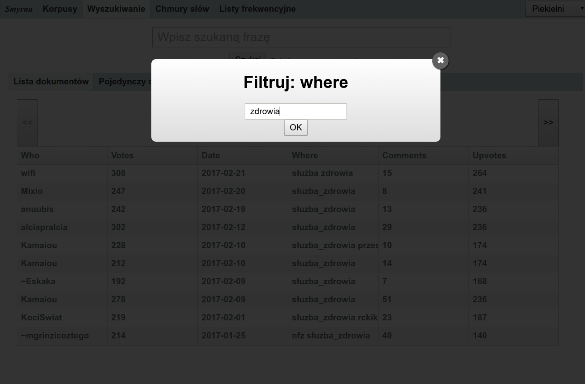
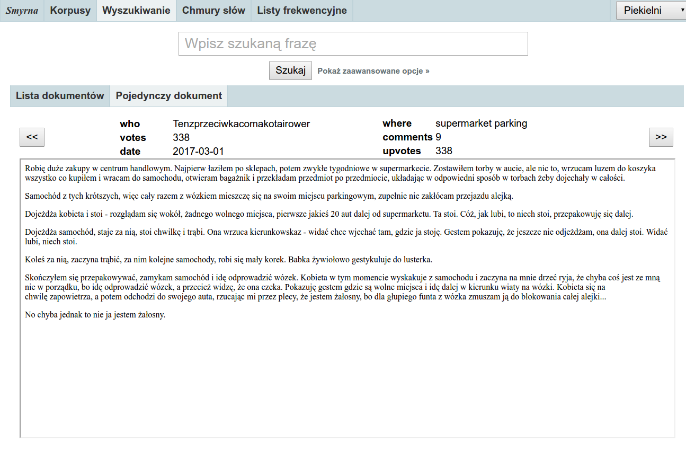
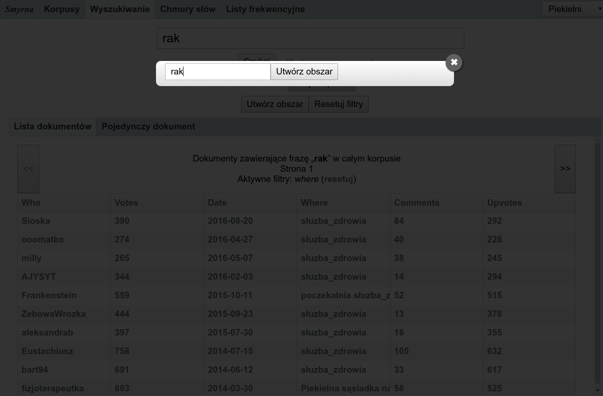
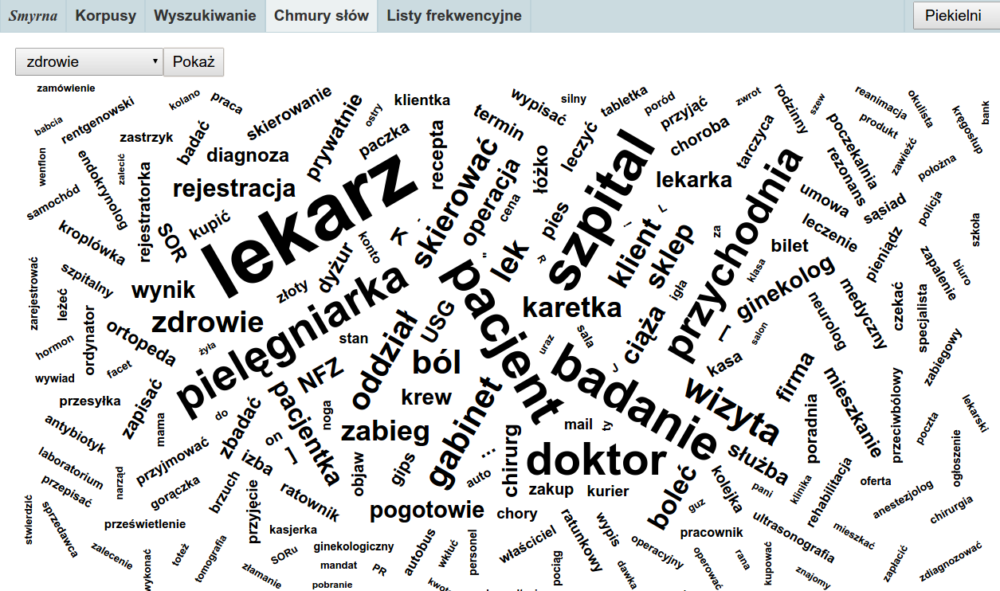
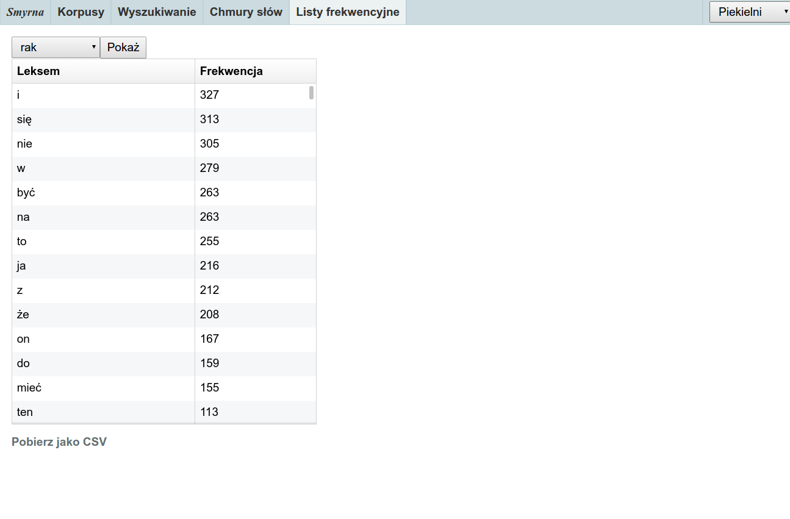

---

<link rel="stylesheet" href="css/modest.css">

## Czym jest Smyrna?

Smyrna to prosty konkordancer obsługujący język polski. Pozwala na łatwe przeszukiwanie i przeprowadzanie prostych analiz statystycznych na zbiorach tekstów w języku polskim, tzw. _korpusach_.

Smyrna obsługuje _metadane_. Oznacza to, że dla każdego dokumentu wchodzącego w skład korpusu można określić dodatkowe informacje opisujące ten dokument, np. tytuł, autora, datę powstania. Informacji tych można potem używać przy przeszukiwaniu i analizowaniu korpusu.

Niniejsza instrukcja obsługi dotyczy wersji 0.3.

## Wymagania systemowe

- System Windows, Linux lub macOS z zainstalowanym środowiskiem [Java] w wersji co najmniej 7
- Współczesna przeglądarka internetowa (zalecana Google Chrome)
- Ok. 1 GB RAM

 [Java]: https://www.java.com/pl/

## Uruchamianie

Aby uruchomić Smyrnę, należy dwukrotnie kliknąć plik `smyrna-0.3.jar` lub wydać z linii komend polecenie:

`java -jar smyrna-0.3.jar`

Spowoduje to uruchomienie przeglądarki i po chwili pokaże się ekran programu.



## Tworzenie korpusów

Pierwszą czynnością jest kliknięcie przycisku _„Stwórz nowy korpus”_. Pojawi się okno, w którym należy wybrać katalog zawierający pliki HTML lub plik z metadanymi w formacie CSV.

Jeśli zostanie wybrany plik CSV, to powinien on mieć nagłówek (pierwszy wiersz) zawierający kolumnę o nazwie `file`. W skład korpusu wejdą wszystkie pliki o nazwach umieszczonych w tej kolumnie. Pozostałe kolumny zostaną uznane za metadane opisujące poszczególne dokumenty.

Przykładowy plik CSV może mieć postać:

```
file,autor,tytuł
potop.html,Henryk Sienkiewicz,Potop
kordian.html,Juliusz Słowacki,Kordian
```

Jeśli zostanie wybrany katalog, to Smyrna przeszuka go w poszukiwaniu plików HTML i jedyną metadaną każdego pliku będzie jego nazwa.



Po kliknięciu przycisku „Utwórz korpus” Smyrna przetworzy wszystkie dokumenty do postaci ułatwiającej przeszukiwanie. Proces ten może potrwać od kilku sekund do kilkunastu minut, w zależności od szybkości komputera i rozmiaru korpusu.



> **Dla użytkowników poprzednich wersji:** Smyrna 0.3 przechowuje każdy korpus jako pojedynczy plik w katalogu o nazwie `.smyrna` (z kropką na początku) znajdującym się w katalogu domowym użytkownika (tzn. np. `C:\Users\użytkownik\.smyrna` w systemie Windows). Inaczej niż w poprzednich wersjach, po utworzeniu korpusu źródłowe pliki `.html` nie są konieczne dla dalszej pracy ze Smyrną — plik korpusu zawiera wszystkie niezbędne informacje. Smyrna 0.3 nie obsługuje korpusów utworzonych za pomocą poprzednich wersji programu — należy zbudować je na nowo.

Po utworzeniu korpusu pojawi się on na liście (jeśli tak się nie stanie, należy odświeżyć stronę w przeglądarce).

Ze strony Smyrny można również pobrać przykładowe, gotowe do przeszukiwania korpusy.

## Przeglądanie i wyszukiwanie

Po wybraniu korpusu pojawia się tabela z metadanymi wszystkich dokumentów w korpusie. Po wpisaniu frazy i kliknięciu „Szukaj” pojawią się tylko te dokumenty, w których ona występuje.



Smyrna przeprowadza automatyczną analizę morfologiczną, tzn. wyszukiwanie słowa _kot_ zwróci również dokumenty zawierające formy _kota_, _kotami_ itp. To samo dotyczy fraz: zapytanie _mały kot_ znajdzie dokumenty zawierające formy typu _małego kota_. Warto zwrócić uwagę, że wszystkie wpisywane słowa powinny być formami podstawowymi, a więc zamiast np. _mała mysz_ należy zadać zapytanie _mały mysz_.

> Inaczej niż w poprzednich wersjach Smyrny, w wersji 0.3 analiza morfologiczna jest wrażliwa na wielkość znaków (więc np. imiona lub skróty typu _PKP_  należy wpisywać wielkimi literami).

Można również filtrować listę dokumentów według metadanych. Kliknięcie w tabeli nazwy dowolnej kolumny spowoduje wyświetlenie okna filtrowania. Na przykład kliknięcie kolumny _Date_ (o ile taka występuje w korpusie) i wpisanie `2016` wyświetli tylko dokumenty z 2016 roku.



Filtrowanie według metadanych można łączyć z wyszukiwaniem pełnotekstowym. Można więc np. wyszukać tylko dokumenty zawierające słowo _kot_ z roku 2016.

**Uwaga:** Inaczej niż w wypadku wyszukiwania w treści dokumentów, dla metadanych nie jest wykonywana analiza morfologiczna. Jeżeli więc chce się znaleźć zarówno dokumenty oznaczone jako „zdrowie” lub „zdrowia”, należy wpisać _zdrowi_.

Kliknięcie w dowolny wiersz w tabeli metadanych spowoduje wyświetlenie odpowiadającego mu dokumentu w zakładce „Pojedynczy dokument”. Przyciskami `<<` i `>>` można przechodzić do następnego lub poprzedniego dokumentu. Jeżeli została zadana fraza do wyszukania, to jej wystąpienia w wyświetlanym dokumencie będą podświetlone i pojawią się przyciski `<` i `>` służące do nawigowania między tymi wystąpieniami.



## Obszary

_Obszarem_ jest zbiór dokumentów stanowiących wyniki wyszukiwania lub filtrowania – inaczej mówiąc, dowolny podzbiór dokumentów w korpusie. Może być nim w szczególności cały korpus.

Obszarowi można nadać nazwę i zapamiętać go. W tym celu należy kliknąć „Pokaż zaawansowane opcje”, po czym kliknąć przycisk „Utwórz obszar”. Pojawi się okienko, w którym Smyrna poprosi o nadanie nazwy obszarowi.



Tak zdefiniowany obszar można poddawać różnym analizom, a także przeszukiwać podobnie jak cały korpus. Można np. zdefiniować obszar „kot”, składający się z dokumentów zawierających frazę _kot_, po czym w tym obszarze wyszukać frazę _pies_. Spowoduje to wyświetlenie dokumentów zawierających zarówno frazę _kot_, jak i _pies_.

## Chmury słów

Zakładka „Chmury słów” pozwala na wygenerowanie jednym kliknięciem zestawu słów charakterystycznych dla danego obszaru w porównaniu do całego korpusu. Wystarczy wybrać uprzednio utworzony obszar i kliknąć „Pokaż”.



Dane słowo jest tym większe na chmurze, im częściej statystycznie pojawia się ono w badanym obszarze w porównaniu do całego korpusu. Statystyką używaną do generowania chmur słów jest _log-likelihood_.

## Listy frekwencyjne

W zakładce „Listy frekwencyjne” można sprawdzić, jakie słowa (dokładniej: formy podstawowe leksemów) pojawiają się najczęściej w korpusie bądź w zadanym obszarze. Po wybraniu obszaru i kliknięciu „Pokaż” Smyrna wygeneruje listę frekwencyjną, którą można przeglądać w tabeli wewnątrz programu albo wyeksportować do formatu CSV, obsługiwanego np. przez program Excel.



## Często zadawane pytania

P: **Jak zakończyć działanie programu Smyrna?**

O: Normalnie nie ma takiej potrzeby, wystarczy zamknąć okno przeglądarki. Smyrna będzie nadal działać w tle i można ponownie uruchomić interfejs wchodząc na adres http://localhost:6510. Jeśli zachodzi konieczność zwolnienia zasobów systemowych, należy użyć systemowego menedżera procesów (Windows: Ctrl-Alt-Del) i zamknąć program `java`.

P: **Jak zapisać chmurę słów w postaci obrazka?**

O: Smyrna nie udostępnia wprost takiej opcji, ale można wykonać zrzut ekranu. Najprościej jest użyć wtyczki do przeglądarki, np. [Awesome Screenshot] dla Chrome.

 [Awesome Screenshot]: https://chrome.google.com/webstore/detail/awesome-screenshot-screen/nlipoenfbbikpbjkfpfillcgkoblgpmj
